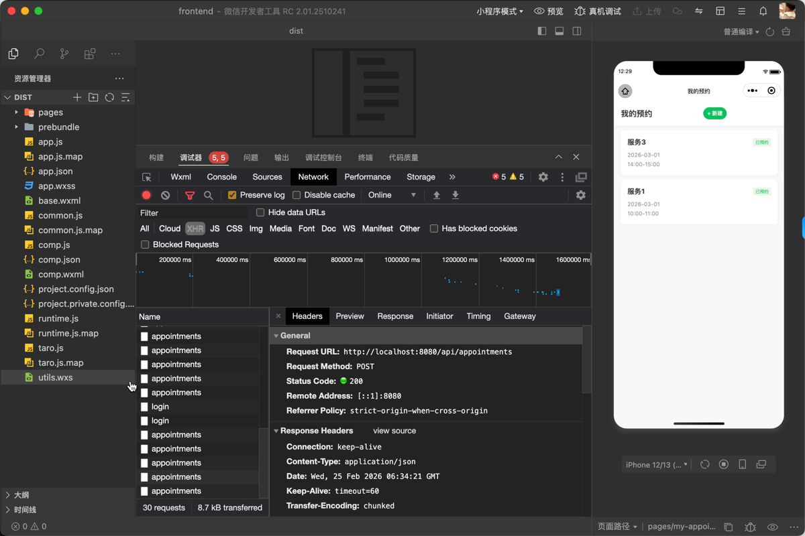
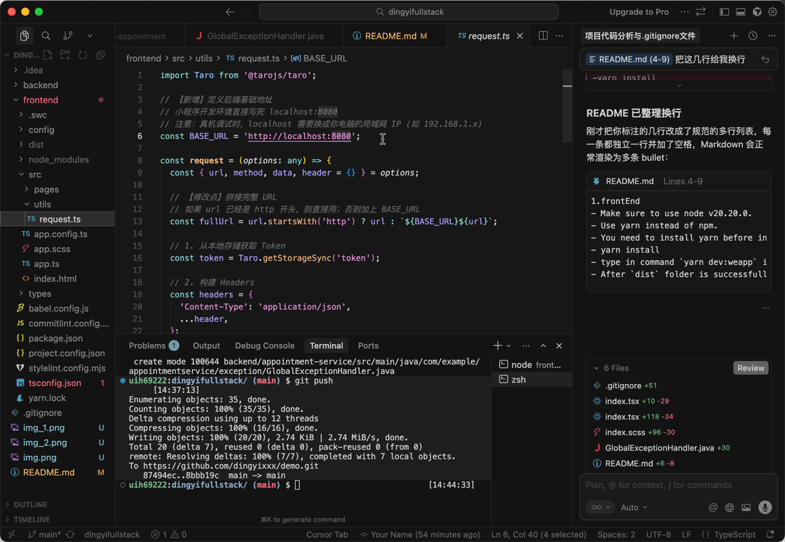
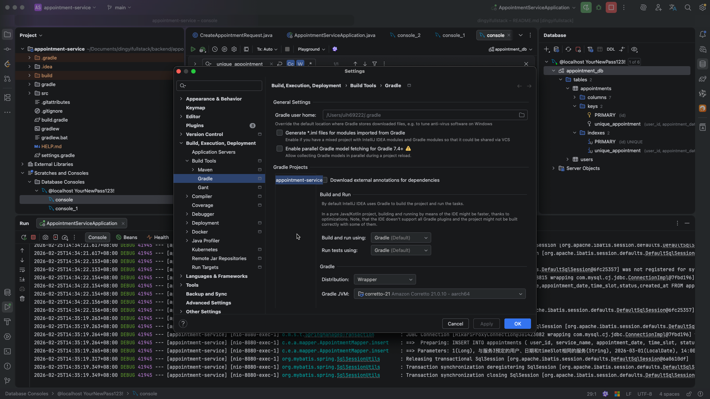
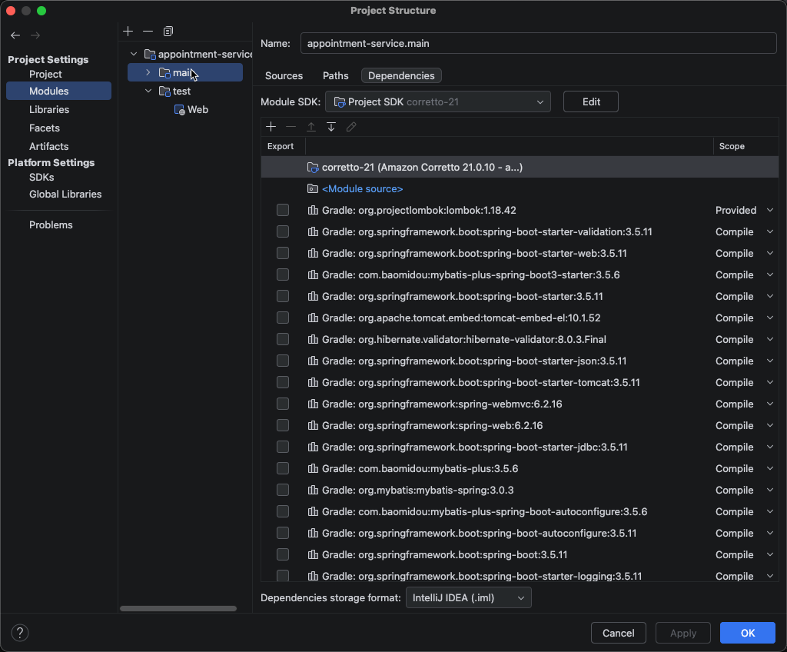
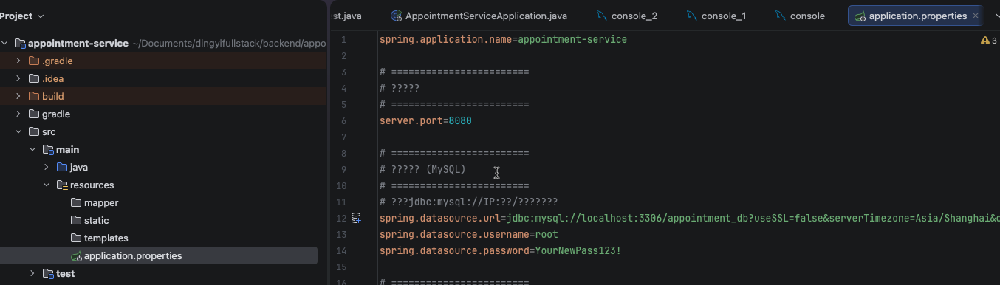
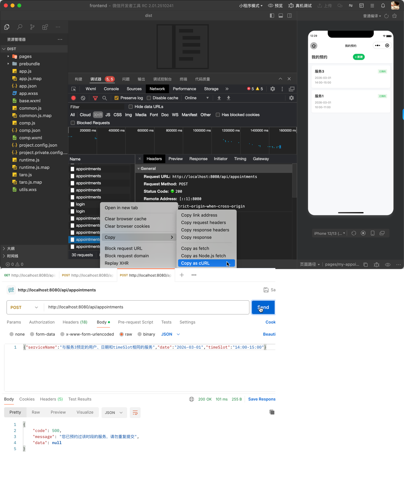
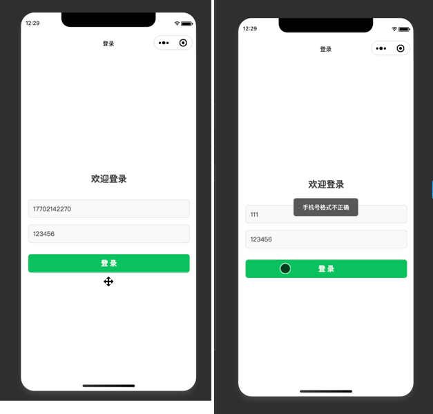
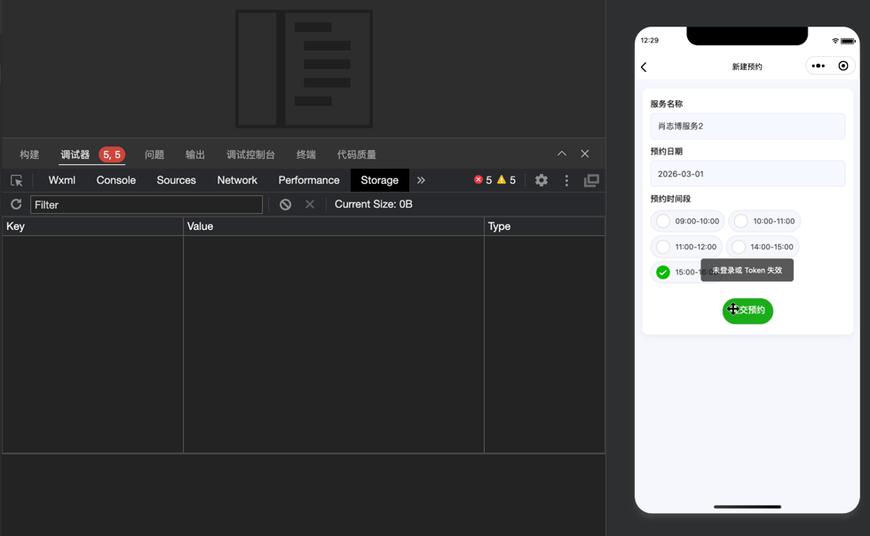
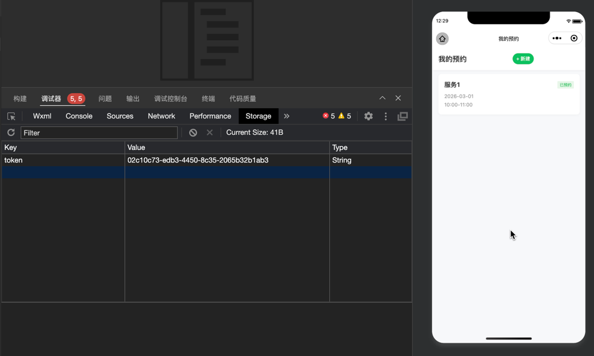

# How to use

1.frontEnd
- Make sure to use node v20.20.0.
- Use yarn instead of npm.
- You need to install yarn before install all the node_modules dependencies.
- Cd to frontend folder and type in command `yarn install`.
- Type in command `yarn dev:weapp` in Cursor or in VScode.
- After `dist` folder is successfully generated, import `dist` folder (instead of the whole `frontend` folder) in mini-program devtool.

- BaseUrls for api call is `http://localhost:8080`. If your backend service uses another port then you should change the above baseurl.

2.backEnd
- Open backend folder in idea.
- Use jdk21 in settings and project structure.

- Default port for the service is 8080. You can change port here.

- Default database connection is as above. I use mysql databse for this project. You should change the database connection configuration url/user/password accordingly.
- Before running the backend service, make sure to run the setup script in `src/main/resources/db/setup.sql` to create relevant the database and tables.
- Run the backend service in debug mode.
- A GlobalExceptionHandler with @RestControllerAdvice annotation is used to catch all the exceptions.
- AOP is used to verify users token.
- Token is valid for 10 hours.
- Idempotency is achieved by using `unique constraint` in mysql.
    

3.Some business flow screenshots
- Enter a valid phone number and always use 123456 as the only correct password to login.

- Redirect user to login page if token is expired or accidentally deleted.

- All the restful API calls will carry token in header automatically.

